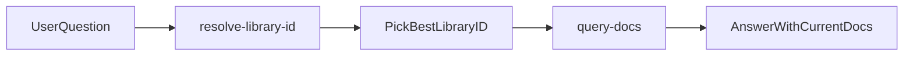

# Context7 in Cursor — Operator Guide

Context7 is an installed Cursor MCP plugin that fetches **up-to-date library documentation**
on demand. Use it for framework API, configuration, migrations, and code examples — not for
Woosoo domain logic, contracts, or production deploy runbooks.

Context7 is **not** part of the Woosoo platform repo. There is no project-specific Context7
config; it is enabled via the Cursor **context7** plugin (`plugin-context7-plugin-context7`).

---

## What It Does

Context7 pulls current documentation and code examples from indexed library sources (official
docs, repos, etc.) so answers reflect recent API changes. It is useful for stacks in this
monorepo: Nuxt 3, Laravel 12, Flutter, Tailwind, Sanctum, Pinia, and similar.

**Prefer Context7 over web search** for library/framework/API questions.

**Do not use Context7 for:**

- Refactoring or code review
- Debugging Woosoo business logic
- General programming concepts
- Writing scripts from scratch with no external library dependency

---

## How You Trigger It

You do not call MCP tools directly. Ask in Cursor chat using natural language:

| You ask | Context7 helps with |
| ------- | ------------------- |
| "How do I configure Nuxt middleware for auth?" | Nuxt docs |
| "What's the Laravel 12 way to define a Form Request?" | Laravel docs |
| "Flutter Bluetooth permission setup on Android 14" | Flutter/Android docs |
| "Pinia store persistence pattern" | Pinia docs |

### Tips for better results

1. **Name the library and version** when it matters (e.g. "Nuxt 3", "Laravel 12", "Vue 3").
2. Ask a **specific question** — one word like "auth" is too vague.
3. If you already know the Context7 library ID, pass it directly: `/vercel/nuxt` or
   `/laravel/docs/v12.x`.

### `/docs` command

The Context7 plugin exposes a **`/docs`** command — "Look up documentation for any library."
Use it when you want an explicit documentation lookup instead of embedding the question in a
larger task prompt.

---

## What the Agent Does Under the Hood

The agent follows a two-step MCP workflow (max 3 calls per tool per question):

### Step 1: `resolve-library-id`

Parameters:

- `libraryName` — official name (e.g. `"Nuxt"`, `"Next.js"`, `"Laravel"`)
- `query` — your full question (improves ranking)

Returns candidates with library ID (format: `/org/project` or `/org/project/version`),
benchmark score, snippet count, and source reputation.

**Skip this step** only if you provide an ID like `/nuxt/nuxt` or `/laravel/docs/v12.x` in
your message.

### Step 2: `query-docs`

Parameters:

- `libraryId` — from step 1 (e.g. `/vercel/nuxt`)
- `query` — your specific question (be detailed)

The agent answers using fetched snippets and cites version when relevant.

---

## When It Activates Automatically

The Cursor **context7-mcp** skill tells the agent to use Context7 when you ask about:

- Setup / configuration
- Library APIs or methods
- Code examples involving a framework
- Version migrations

For heavier doc lookups, the agent may delegate to the **docs-researcher** subagent to avoid
bloated main-chat context.

---

## Woosoo-Relevant Examples

Context7 is most useful for **Tier 1–2 app work** where you need current framework syntax.

**Tablet (`tablet-ordering-pwa/`)**

- "Nuxt 3 `useFetch` error handling and retry"
- "Vue 3 composable cleanup in `onUnmounted`"
- "PWA service worker update strategies in Vite/Nuxt"

**Backend (`woosoo-nexus/`)**

- "Laravel Sanctum SPA authentication cookie setup"
- "Laravel 12 queue job retry/backoff configuration"
- "Laravel Reverb broadcasting channel authorization"

**Print bridge (`woosoo-print-bridge/`)**

- "Flutter bluetooth_classic permissions Android 13+"
- "Dart async stream subscription cancel patterns"

Context7 does **not** replace Woosoo contracts (`contracts/`) or case files — use it for
**library mechanics**, not order state, auth policy, or print dispatch rules.

---

## Security

Context7 queries are sent to the Context7 API. **Do not include** in your questions:

- API keys or tokens
- `.env` values or credentials
- Personal data
- Proprietary Woosoo business logic

---

## Quick Reference

| Action | How |
| ------ | --- |
| Look up library docs | Ask naturally in chat or run `/docs` |
| Force a specific doc set | Include library ID: `/org/project/version` |
| Best for | Framework API, config, migrations, examples |
| Not for | Woosoo domain logic, contracts, production deploy runbooks |
| MCP server name | `context7` (`plugin-context7-plugin-context7`) |
| Tools | `resolve-library-id` → `query-docs` |

No repo setup is required. If the Context7 plugin is enabled in Cursor, start by asking
library-specific questions in chat.

---

## Related

- [USAGE_GUIDE.md § Cursor Hybrid Workflow](USAGE_GUIDE.md#5-cursor-hybrid-workflow-experimental--tier-12-only) — when to use Cursor vs Claude Code for Specialist work
