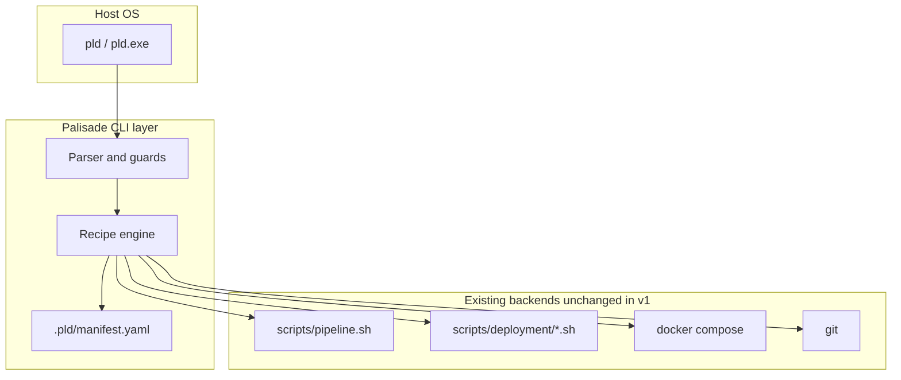

# ADR: Palisade CLI (`pld`) — command base and migration from Woosoo Bash

> **Status:** canonical (approved 2026-06-08). Future Palisade `pld` binary: [tools/pld/README.md](../../tools/pld/README.md).
> Related: [[infra-case-005-local-pipeline-runner]], WSL workflow in [USAGE_GUIDE.md § 6](../USAGE_GUIDE.md).

## Context

Woosoo-platform orchestrates three app repos, Docker Compose, TLS certs, and Pi production deploy
from a **platform root**. Operators and agents invoke long, easy-to-get-wrong command sequences;
Windows and WSL use **separate git clones** with separate `.env` files.

### Current command base (audit)

| Component | Path | Role | OS support |
| --------- | ---- | ---- | ---------- |
| Entry script | [`run`](../../run) | Resolves platform root (symlink-safe); execs pipeline | Any shell that can run Bash |
| Pipeline router | [`scripts/pipeline.sh`](../../scripts/pipeline.sh) | Targets, flags, step orchestration | Bash (WSL, Pi, macOS, Linux) |
| Global install | [`scripts/install.sh`](../../scripts/install.sh) | Symlink `/usr/local/bin/woosoo` → `run` | Unix only (not native Windows) |
| UI helpers | [`scripts/lib/pipeline-ui.sh`](../../scripts/lib/pipeline-ui.sh) | Step banners, summary | Bash |
| Host network | [`scripts/lib/host-network.sh`](../../scripts/lib/host-network.sh) | LAN IP, PUBLIC_HOST, certs, portproxy | Bash |
| Dev preflight | [`scripts/deployment/dev-preflight.sh`](../../scripts/deployment/dev-preflight.sh) | Auto-fix env drift | Bash |
| Env check | [`scripts/deployment/check.sh`](../../scripts/deployment/check.sh) | APP_KEY, ports, compose config | Bash |
| Dev bootstrap | [`scripts/deployment/dev-docker-bootstrap.sh`](../../scripts/deployment/dev-docker-bootstrap.sh) | Seed `woosoo-nexus/.env` (WSL) | Bash |
| Pi deploy chain | `deploy-all.sh`, `deploy.sh`, `apply-woosoo-config.sh`, `doctor.sh`, `woosoo-health.sh` | Production path | Bash (Pi / root) |
| Windows helpers | `scripts/windows/*.ps1`, `scripts/pre-merge-check.ps1`, `scripts/obsidian-*.ps1` | LAN bridge (elevated), governance, vault | **Windows PowerShell only** |
| Runtime engine | [`compose.yaml`](../../compose.yaml) + `docker compose` | All environments | Requires Docker |

**Current targets** (`woosoo <target>` / `./run <target>`):

| Target | Purpose |
| ------ | ------- |
| `dev` | Pull → bootstrap → build → up → migrate → warm → health |
| `staging` | Staging-parity via `woosoo.env` |
| `pi` | Production Pi deploy (root + `woosoo.env`) |
| `health` | Inline service + HTTP checks |
| `network` | PUBLIC_HOST sync, LAN bridge, optional `--regen-certs` |
| `logs` | `docker compose logs -f` |
| `check` | Preflight + `check.sh` |

**Dev flags:** `--no-pull`, `--no-build`, `--from-step N`, `--dry-run`  
**Network flags:** `--regen-certs`, `--dry-run`

### Pain points driving change

1. **Discoverability** — cert regen, post-push sync, and frontend rebuild require memorized docker/git strings.
2. **Two-clone drift** — Windows `E:\Projects\...` vs WSL `~/projects/...`; `.env` and APP_KEY not synced by git.
3. **Agent anti-patterns** — host `composer dev`, `localhost:8000`, `/mnt/e/...` paths.
4. **No native Windows CLI** — PowerShell scripts are fragmented; deploy assumes WSL Bash.
5. **Bootstrap footgun** — `dev-docker-bootstrap.sh` can wipe a valid `.env` when drift checks re-trigger bootstrap.

### Palisade brand alignment

**Palisade** = perimeter defense; **`pld`** = gate entrypoint. CLI domains map to structural zones:
env (quartermaster), net (perimeter), stack (garrison), repo (modules), build (armory), watch
(watchtower), sync (controlled ingress after upstream changes).

---

## Decision

**Adopt a Go-compiled `pld` binary as the primary cross-platform CLI entrypoint**, backed by:

1. A **recipe manifest** (`.pld/manifest.yaml`) for modules, profiles, and compose paths.
2. **Delegation to existing Bash** (`pipeline.sh`, deployment scripts) during migration — no rewrite of Pi deploy in v1.
3. **`woosoo` as a deprecated alias** to `pld` until a documented sunset date.

### Why Go (not Bash-only, Bash+PS, Node, or Python)

| Option | Linux / Pi | macOS | Windows native | Host runtime | Maintenance |
| ------ | ---------- | ----- | -------------- | ------------ | ----------- |
| Bash only (today) | Excellent | Good | Poor | None | Low on Unix; fails Windows-without-WSL |
| Bash + PowerShell | Good | Good | Good | None | **High** — dual trees, drift |
| Node.js CLI | Good | Good | Good | Node on host | Medium; Pi may lack host Node |
| Python CLI | Good | Good | Mixed | Python on host | Medium |
| **Go binary** | **Excellent** | **Excellent** | **Excellent** (`.exe`) | **None** | Low; single codebase |

Go matches industry patterns for ops CLIs (`docker`, `kubectl`, `gh`, `terraform`): one
artifact per OS/arch, subprocess to `git`/`docker`, structured `--json` for agents, no second
script tree for Windows.

**Rejected for v1:** parallel Bash + PowerShell orchestration; rewriting `deploy-all.sh` in Go.

---

## Target architecture



### Workspace resolution

`pld` resolves **platform root** using (in order):

1. `PLD_ROOT` or `WOOSOO_PLATFORM_PATH` env var
2. Walk upward from CWD for `.pld/manifest.yaml` or `compose.yaml` + `run`
3. Symlink-safe self-path (same algorithm as [`run`](../../run) `_resolve_platform_root`)

### Command grammar (target)

**Pattern:** `pld <domain> <action> [resource] [flags]` plus workflow shortcuts.

| Domain | Actions | Woosoo / today equivalent |
| ------ | ------- | ------------------------- |
| **sync** | *(shortcut)* | *new* post-push path; `dev --no-pull` subset |
| **sync --full** | *(shortcut)* | `woosoo dev` |
| **repo pull** | `[module]` | `git -C woosoo-nexus pull` (partial `_dev_pull`) |
| **net sync** | | `woosoo network` |
| **net certs** | | `woosoo network --regen-certs` |
| **stack up/down/restart/logs/ps** | `[service]` | `docker compose …` |
| **build web** | `--force` | `WOOSOO_FORCE_VITE_BUILD=true … up --build app` |
| **build php** | | `docker compose exec app composer install` |
| **watch doctor** | | `woosoo check` |
| **watch health** | | `woosoo health` |
| **watch preflight** | | `dev-preflight.sh` |
| **env init/check** | | `dev-docker-bootstrap.sh`, `check.sh` (guarded) |
| **run exec** | `app -- …` | `docker compose exec app …` (escape hatch) |
| **dev** | | `woosoo dev` (alias → `sync --full`) |
| **staging** | | `woosoo staging` |
| **pi** | | `woosoo pi` (delegates unchanged) |
| **logs** | | `woosoo logs` |

### Full command mapping (current → target)

| Current | Palisade target | Phase available |
| ------- | --------------- | --------------- |
| `./run dev` | `pld sync --full` or `pld dev` | 1 (alias) / 2 (Go) |
| `./run dev --no-pull --no-build` | `pld sync` | 2 |
| `./run dev --no-pull` | `pld sync --no-build` | 2 |
| `./run dev --from-step 4` | `pld sync --from-step 4` | 3 |
| `./run network` | `pld net sync` | 2 |
| `./run network --regen-certs` | `pld net certs` | 2 |
| `./run health` | `pld watch health` | 2 |
| `./run check` | `pld watch doctor` | 2 |
| `./run logs` | `pld stack logs` or `pld logs` | 2 |
| `./run staging` | `pld staging` | 2 (delegate) |
| `./run pi` | `pld pi` | 2 (delegate) |
| *(manual)* vite rebuild | `pld build web --force` | 1 (bash) / 2 (Go) |
| *(manual)* APP_KEY fix | `pld env check` + auto-fix in `pld sync` | 2 |
| `bash scripts/install.sh` | `pld install` or platform installer | 3 |

**Canonical post-push flow (operators + agents):**

```bash
cd ~/projects/woosoo-platform   # WSL platform root
pld sync                        # pull nexus dev, preflight, up, key/cache fix, URL hint
# Browser: https://$PUBLIC_HOST  (e.g. https://192.168.100.7)
```

Interim before Go ships: `woosoo sync` implemented in Bash per [CLI simplification plan](https://github.com/ryanpastorizadev-bit/woosoo-platform).

### Windows story (explicit)

| Concern | Requirement |
| ------- | ----------- |
| **`pld` invocation** | Native `pld.exe` on Windows — no “run bash first” for CLI |
| **Container runtime** | Docker Desktop or WSL2 + Docker Engine — documented separately |
| **Edit vs run** | Windows clone for Cursor edit; WSL clone for `pld sync` — two trees, pull after push |
| **LAN / portproxy** | `pld net sync` invokes elevated PowerShell via existing `scripts/windows/` (same as today) |
| **Install** | `pld install` adds `%LOCALAPPDATA%\Programs\pld\pld.exe` to PATH; optional `pld.ps1` shim |

**Not required:** native Windows PHP/Composer/Node for app builds — all app tooling stays in containers.

---

## Migration phases (with rollback)

### Phase 0 — Bash ergonomics (no Go) — *shipped 2026-06-08*

**Goal:** Reduce command surface before `pld` binary exists.

- `woosoo sync`, `woosoo rebuild`, `woosoo certs` in [`pipeline.sh`](../../scripts/pipeline.sh).
- `_dev_bootstrap_needed` no longer re-seeds `.env` when only APP_KEY is missing.
- [USAGE_GUIDE.md § 6](../USAGE_GUIDE.md), [DEPLOYMENT_GUIDE.md § 4](../deployment/DEPLOYMENT_GUIDE.md) updated.

**Rollback:** Remove new targets from `pipeline.sh`; docs revert.

### Phase 1 — Alias layer — *shipped 2026-06-08*

**Goal:** Introduce `pld` name without new runtime.

- [`scripts/install.sh`](../../scripts/install.sh) symlinks `/usr/local/bin/pld` and `woosoo` → `run`.
- [`run`](../../run) exports `WOOSOO_CLI_INVOKED_AS`; `pipeline.sh` deprecates `woosoo` with one-line notice.
- [`.pld/manifest.yaml`](../../.pld/manifest.yaml) — declarative module/profile stub for Phase 2 Go binary.
- Windows: [`pld.ps1`](../../pld.ps1) / [`pld.cmd`](../../pld.cmd) — WSL `./run` shim (not native Go).

**Rollback:** `bash scripts/install.sh --uninstall`; remove `pld.ps1` / `pld.cmd`.

### Phase 2 — Go wrapper binary

**Goal:** Native `pld` on Linux, macOS, Windows; delegate to Bash for heavy recipes.

- New [`tools/pld/`](../../tools/pld/README.md): `cmd/pld/main.go`, Cobra commands, `exec` to
  `bash scripts/pipeline.sh <mapped-target>`.
- Resolve root via manifest + env; `--json` on `watch doctor` / `watch health`.
- CI: `goreleaser` or `go build` matrix (linux/amd64, linux/arm64, darwin, windows/amd64).
- `woosoo` → prints once-per-run: “use `pld` instead”.

**Rollback:** Uninstall `pld.exe`; use `./run` directly (unchanged).

### Phase 3 — Native recipes in Go

**Goal:** Port high-frequency paths (`sync`, `net certs`, `build web`) into Go; Bash remains for Pi deploy.

- Recipe engine reads `.pld/recipes/*.yaml`.
- `pld pi` / `pld staging` always delegate to Bash until explicitly ported.
- Remove duplicate compose string literals from docs; `pld` is single source of invoked commands.

**Rollback:** Go binary falls back to Bash delegation per command flag `--legacy`.

---

## Consequences

### Positive

- One installable binary on all host OSes; agents get stable grammar and `--json`.
- Palisade brand separated from Woosoo product name while preserving backward compatibility.
- Pi production path untouched until explicitly ported.

### Negative / risks

- Go toolchain and release pipeline added to platform repo maintenance.
- Phase 1 Windows shim without Go is still Bash-dependent — must not oversell Phase 1 as “native Windows”.
- Dual naming (`woosoo` + `pld`) until sunset — docs must stay synchronized.

### Guardrails (immutable)

- No host `composer` / `php artisan` on WSL shell — `pld run exec app -- …` only.
- Platform root for all orchestration — never `cd woosoo-nexus` as deploy root.
- Pi deploy: `pld pi` delegates to existing scripts; no behavior change without Tier 3 case.

---

## Success criteria (this ADR)

1. Current Woosoo CLI stack documented with paths and OS matrix — **§ Context**
2. Go binary named as primary entrypoint with comparison table — **§ Decision**
3. Command grammar maps every current `woosoo *` target — **§ Full command mapping**
4. ≥3 migration phases with rollback — **§ Migration phases**
5. Windows story explicit — **§ Windows story**
6. Canonical post-push flow = `pld sync` — **§ Command grammar**

---

## References

- [infra-case-005-local-pipeline-runner](../cases/infra-case-005-local-pipeline-runner.md) — symlink root fix
- [infra-case-006-dynamic-lan-host](../cases/infra-case-006-dynamic-lan-host.md) — `woosoo network`
- [USAGE_GUIDE.md § 6](../USAGE_GUIDE.md) — WSL dev test workflow
- [DEPLOYMENT_GUIDE.md § 4](../deployment/DEPLOYMENT_GUIDE.md) — Path B dev deploy
- [tools/pld/README.md](../../tools/pld/README.md) — Go scaffold spec (design)
